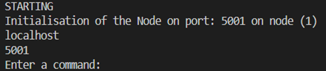

# QUBerium: An Environmentally Friendly Cryptocurrency for Queen's University Belfast

## Name
QUBerium: An Environmentally Friendly Cryptocurrency for Queen's University Belfast

## Description
QUBerium is a peer-to-peer decentralised blockchain using a proof-of-stake consensus mechanism for storing and verifying student records. This project is designed to store records securely against internal and external attacks, with each record being verifiably correct and in a distributed manner, so that the network can continue under great strain.

This project is available from this repository, requiring an access request to the author.

## Requirements
This project should run on most systems. It has been benchmarked to run well on the following specification:
HP 250 G7 Laptop
CPU: Intel Core i3-7020U @2.3GHz Dual Core
RAM: 8GB DDR3
OS: Windows 10/Linux

A python installation is required along with the following package dependencies:
json
time
threading
hashlib
boto3
p2pnetwork
rsa

For more information on versioning see requirements.txt

## Installation
1. Clone the repository to your local machine
2. Using your command terminal of choice navigate to the cloned directory and to the /src directory containing 'main.py'
3. Use the following command to launch the program: 'main.py <ip> <port> <permission level> <id>'
    E.g. 'main.py localhost 5001 "admin" 40233186
4. To verify the installation has been correct, you should see the following upon startup:

## Usage
ADDING A NEW RECORD
Prerequisite: Must be logged in as an administrator.

1.	Enter ‘newrecord’ when prompted.
a.	If you are logged in as a student you should see “Insufficient Privilege” on the console
2.	 Enter student details when prompted.
a.	Enter the student’s forename.
b.	Enter the student’s surname.
c.	Enter the student’s ID.
3.	For each of the modules and grades, add another by entering ‘Y’ when prompted, or ‘N’ to finish.
4.	The user should see the string representation of the validator’s public key printed to the console.
5.	When the message ‘New Record Added’ is displayed on the console the record has been added to the chain. Otherwise, if the block is deemed invalid:
a.	The message ‘Invalid Block’ will be displayed, meaning that the block storing the new record has an issue.
b.	If the block has been tampered with, the perpetrator’s ID will be printed to the console.
c.	The reason for the block’s failure will also be printed e.g., “Invalid Hash”.
6.	To verify the correctness of the operation, enter ‘blockchain’ in the command prompt.
7.	The block’s data will be encrypted but the index and block information viewable as the newest block on the chain.
8.	To check student data is correct use the search function, see section 5.2.
----------------------------------------------------------------------------------------------------------------------
SEARCHING FOR A STUDENT’S RECORD
Prerequisite: Must be logged in as an administrator.

1.	Enter ‘search’ when ‘Enter A Command:’ is displayed on the console.
a.	If you are logged in as a student you should see “Insufficient Privilege” on the console
2.	Enter the student’s ID when prompted.
3.	If the student’s ID is stored on the blockchain then the record will be printed to the console
a.	Otherwise, if no such student can be found “Student Record Not Found” will be printed
----------------------------------------------------------------------------------------------------------------------
VIEWING YOUR RECORD AS A STUDENT
Prerequisite: Must be logged in as a student.

1.	Enter ‘myrecords’ when ‘Enter A Command:’ is displayed on the console.
a.	If you are logged in as an administrator, the user should see “Please Use The Search Function To Find Student Records” on the console
2.	If the request is sent successfully the user will see “Request Sent” on the terminal
3.	If found by the administrator node, the records will then be sent back to the user and printed
a.	Otherwise, “Records Not Found – Please Contact Administrator” will be displayed.
----------------------------------------------------------------------------------------------------------------------
SENDING TOKENS TO OTHER NODES
1.	Enter ‘transaction’ when prompted.
2.	The users balance will be displayed along with a prompt asking how much to send. Enter the desired amount.
3.	The terminal will then prompt the user for the ID of the user who will be receiving the tokens, enter this value into the terminal.
a.	If the ID is not known to the user, “Receiver ID Not Found” will be printed.
4.	To verify the transaction has been sent, enter ‘blockchain’ on the terminal.
5.	The latest block in the blockchain should contain the transaction that has just been created.
6.	To verify that it has executed correctly, enter ‘balances’.
7.	The user’s balance should be their previous balance minus the amount sent.
8.	The receiver’s balance should be their previous balance plus the amount received

## Authors and acknowledgment
Author: Cameron McGreevy
Acknowledgment to Ihsen Alouani for his help in creating and designing the project.

## License
MIT License

Copyright (c) 2023 Cameron McGreevy

Permission is hereby granted, free of charge, to any person obtaining a copy
of this software and associated documentation files (the "Software"), to deal
in the Software without restriction, including without limitation the rights
to use, copy, modify, merge, publish, distribute, sublicense, and/or sell
copies of the Software, and to permit persons to whom the Software is
furnished to do so, subject to the following conditions:

The above copyright notice and this permission notice shall be included in all
copies or substantial portions of the Software.

THE SOFTWARE IS PROVIDED "AS IS", WITHOUT WARRANTY OF ANY KIND, EXPRESS OR
IMPLIED, INCLUDING BUT NOT LIMITED TO THE WARRANTIES OF MERCHANTABILITY,
FITNESS FOR A PARTICULAR PURPOSE AND NONINFRINGEMENT. IN NO EVENT SHALL THE
AUTHORS OR COPYRIGHT HOLDERS BE LIABLE FOR ANY CLAIM, DAMAGES OR OTHER
LIABILITY, WHETHER IN AN ACTION OF CONTRACT, TORT OR OTHERWISE, ARISING FROM,
OUT OF OR IN CONNECTION WITH THE SOFTWARE OR THE USE OR OTHER DEALINGS IN THE
SOFTWARE.

